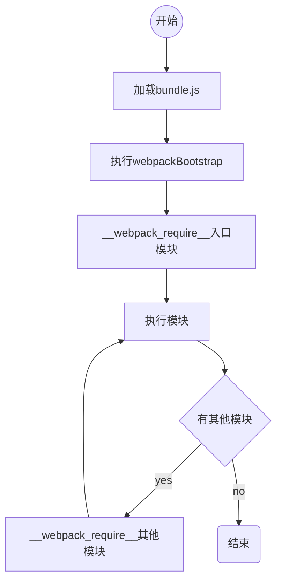

### Webpack原理解析一
我们一直使用webpack来构建前端项目，今天来看看导致webpack打包完项目后的代码是怎么执行的。

<!-- more -->

### 解析bundle
首先我们来看一个最简单的`webpack`案例:
```js
  module.exports = {
    entry: './src/index.js',
    mode: 'development',
    output: {
      filename: '[name].[hash].js',
      path: path.resolve(__dirname, 'dist'),
      libraryTarget: 'umd'
    },
    devtool: 'source-map',
  }
```
上面是一个最简单的案例,我们的项目入口是`index.js`，然后`index.js`引入了`module.js`
我们来简单分析下打包后的代码:
```js
  // 首先我们看到因为libraryTarget: 'umd';所以打包后的代码是使用umd规范的
  (function webpackUniversalModuleDefinition (root, factory) {
    if (typeof exports === 'object' && typeof module === 'object')
      module.exports = factory();
    else if (typeof define === 'function' && define.amd)
      define([], factory);
    else {
      var a = factory();
      for (var i in a) (typeof exports === 'object' ? exports : root)[i] = a[i];
    }
  }) (window, function () {
    // 我们再来分析factory这块代码
    // 我们会发现factory执行后是返回的一个自执行的匿名函数，我们来看看这个匿名函数
    return (function (modules) { // webpackBootstrap
      // 首先`webpackBootstrap` 这个启动函数会接受一个modules参数
      // The module cache 加载过的模块会被缓存到这个对象里面
      var installedModules = {};

      // The require function 这是通过模块id加载模块的函数，
      function __webpack_require__ (moduleId) {

        // Check if module is in cache 如果模块被缓存，就直接返回缓存的exports
        if (installedModules[moduleId]) {
          return installedModules[moduleId].exports;
        }
        // Create a new module (and put it into the cache)
        // 如果没有被缓存就先再缓存对象存起来，l(load)属性标记为false
        var module = installedModules[moduleId] = {
          i: moduleId,
          l: false,
          exports: {}
        };

        // Execute the module function
        // 根据模块id找到模块代码，并执行，通过call方法该改了执行函数里面的this对象
        // 并传入了 module, module.exports, __webpack_require__
        modules[moduleId].call(module.exports, module, module.exports, __webpack_require__);

        // Flag the module as loaded
        // 模块已加载
        module.l = true;

        // Return the exports of the module
        // 返回模块的exports
        return module.exports;
      }


      // expose the modules object (__webpack_modules__)
      // 把模块暴露到__webpack_require__上面
      __webpack_require__.m = modules;

      // expose the module cache
      // 把缓存的模块暴露到__webpack_require__上面
      __webpack_require__.c = installedModules;

      // define getter function for harmony exports
      //  定义 exports 对象导出的属性。
      __webpack_require__.d = function (exports, name, getter) {
        // 如果 exports （不含原型链上）没有 [name] 属性，定义该属性的 getter。
        if (!__webpack_require__.o(exports, name)) {
          Object.defineProperty(exports, name, { enumerable: true, get: getter });
        }
      };

      // define __esModule on exports
      __webpack_require__.r = function (exports) {
        if (typeof Symbol !== 'undefined' && Symbol.toStringTag) {
          Object.defineProperty(exports, Symbol.toStringTag, { value: 'Module' });
        }
        Object.defineProperty(exports, '__esModule', { value: true });
      };

      // create a fake namespace object
      // mode & 1: value is a module id, require it
      // mode & 2: merge all properties of value into the ns
      // mode & 4: return value when already ns object
      // mode & 8|1: behave like require
      __webpack_require__.t = function (value, mode) {
        if (mode & 1) value = __webpack_require__(value);
        if (mode & 8) return value;
        if ((mode & 4) && typeof value === 'object' && value && value.__esModule) return value;
        var ns = Object.create(null);
        __webpack_require__.r(ns);
        Object.defineProperty(ns, 'default', { enumerable: true, value: value });
        if (mode & 2 && typeof value != 'string') for (var key in value) __webpack_require__.d(ns, key, function (key) { return value[key]; }.bind(null, key));
        return ns;
      };

      // getDefaultExport function for compatibility with non-harmony modules
      __webpack_require__.n = function (module) {
        var getter = module && module.__esModule ?
          function getDefault () { return module['default']; } :
          function getModuleExports () { return module; };
        __webpack_require__.d(getter, 'a', getter);
        return getter;
      };

      // Object.prototype.hasOwnProperty.call
      // 包装 Object.prototype.hasOwnProperty 函数。
      __webpack_require__.o = function (object, property) { return Object.prototype.hasOwnProperty.call(object, property); };

      // __webpack_public_path__
      __webpack_require__.p = "";


      // Load entry module and return exports
      // 走到这里，我么发现开始加载我们的entry file
      return __webpack_require__(__webpack_require__.s = "./src/index.js");
    })
      /****/ // 这里就是webpackBootstrap接受的module参数，我们发现是个对象
      /****/ // 模块id 其实就是我们的文件路径，模块的内容就是我们的代码
      ({

        "./src/index.js": (function (module, exports, __webpack_require__) {
          // 我们再模块加载的时候会改变函数内的this，并传入了module, exports, __webpack_require__
          // 再这里，我们代码还引入了其他模块，这时就使用到了__webpack_require__
          const a = __webpack_require__(/*! ./module.js */ "./src/module.js");

          console.log(a);
        }),

        "./src/module.js": (function (module, exports) {
          // module.js是被index.js引用的
          // 这里的module参数就是上面我们需要缓存的module
          module.exports = {
            a: '11'
          };

          /***/
        })

      });
  });
```
我们来看下流程



### chuck
我们来对上面的`index.js`，做下小小的修改

```js
  const a = import('./module.js');
  console.log(a);
```
我们再来看看，打包后的代码有什么变化
首先不再仅仅只有一个`bundle`文件了，我们还有一个`chunck`文件,我们先来看看这个`bundle`文件和之前的有什么区别

```js
  // bundle 文件
  (function webpackUniversalModuleDefinition (root, factory) {
    if (typeof exports === 'object' && typeof module === 'object')
      module.exports = factory();
    else if (typeof define === 'function' && define.amd)
      define([], factory);
    else {
      var a = factory();
      for (var i in a) (typeof exports === 'object' ? exports : root)[i] = a[i];
    }
  })(window, function () {
    return (function (modules) { // webpackBootstrap
      // install a JSONP callback for chunk loading
      // 首先这里多了webpackJsonpCallback函数, 我们来了解下这个函数是干嘛的
      function webpackJsonpCallback (data) {
        // 首先接受data参数, data是一个数组，第0个是模块id的数组，第二个是模块对象
        var chunkIds = data[0];
        var moreModules = data[1];


        // add "moreModules" to the modules object,
        // then flag all "chunkIds" as loaded and fire callback
        var moduleId, chunkId, i = 0, resolves = [];
        // 将 chunk 标记为已加载
        for (; i < chunkIds.length; i++) {
          chunkId = chunkIds[i];
          if (Object.prototype.hasOwnProperty.call(installedChunks, chunkId) && installedChunks[chunkId]) {
            // 如果 installedChunks 是正在加载，就把chunck promise 的reslove方法放到resolves数组中
            resolves.push(installedChunks[chunkId][0]);
          }
          // 标记chuck加载完成
          installedChunks[chunkId] = 0;
        }
        // 把 "moreModules" 加到 webpackBootstrap 中的 modules 闭包变量中。
        for (moduleId in moreModules) {
          if (Object.prototype.hasOwnProperty.call(moreModules, moduleId)) {
            // 把chunck中的模块存到总模块对象池中
            modules[moduleId] = moreModules[moduleId];
          }
        }
        // parentJsonpFunction 是 window["webpackJsonp"] 的原生 push
        // 将 data 加入全局数组，缓存 chunk 内容
        if (parentJsonpFunction) parentJsonpFunction(data);

        while (resolves.length) {
          // 执行 resolve 后，加载 chunk 的 promise 状态变为 resolved，then 内的函数开始执行。 
          // 以栈的形式把resolves数组中加载chunck的任务完成
          resolves.shift()();
        }

      };


      // The module cache
      var installedModules = {};

      // object to store loaded and loading chunks
      // undefined = chunk not loaded, null = chunk preloaded/prefetched
      // Promise = chunk loading, 0 = chunk loaded
      // 这个是用来标记加载chuck模块的, 0标记这个chuck加载完成
      // 如果不是0，那就有可能没加载，那就是undefined， 准备加载就是null
      // 最后一种状态就是正在加载，正在加载，值是一个数组[resolve, reject, promise]
      var installedChunks = {
        "main": 0
      };


      // script path function
      // 拼接chunck脚本src
      function jsonpScriptSrc (chunkId) {
        return __webpack_require__.p + "" + ({}[chunkId] || chunkId) + "." + { "0": "c040dd6d0bc4" }[chunkId] + ".js"
      }

      // The require function
      function __webpack_require__ (moduleId) {

        // Check if module is in cache
        if (installedModules[moduleId]) {
          return installedModules[moduleId].exports;
        }
        // Create a new module (and put it into the cache)
        var module = installedModules[moduleId] = {
          i: moduleId,
          l: false,
          exports: {}
        };

        // Execute the module function
        modules[moduleId].call(module.exports, module, module.exports, __webpack_require__);

        // Flag the module as loaded
        module.l = true;

        // Return the exports of the module
        return module.exports;
      }

      // This file contains only the entry chunk.
      // The chunk loading function for additional chunks
      // 加载chunck,
      __webpack_require__.e = function requireEnsure (chunkId) {
        var promises = [];


        // JSONP chunk loading for javascript
        // installedChunks 是在 webpackBootstrap 中维护的 chunk 缓存
        var installedChunkData = installedChunks[chunkId];
        // 到已加载的chunck对象池中查找，如果是0，说明加载过了
        if (installedChunkData !== 0) { // 0 means "already installed".

          // a Promise means "currently loading".
          // 如果有说明正在加载
          if (installedChunkData) {
            // 正加载就把第三个参数放到promises里面去
            promises.push(installedChunkData[2]);
          } else {
            // setup Promise in chunk cache
            // 这里说明还没有加载，就新建加载任务
            var promise = new Promise(function (resolve, reject) {
              installedChunkData = installedChunks[chunkId] = [resolve, reject];
            });
            promises.push(installedChunkData[2] = promise);

            // start chunk loading
            // 通过script加载，因为我们加载的chunck，脚本都是下面的形式
            // (window["webpackJsonp"] = window["webpackJsonp"] || []).push([[....], {}]);
            var script = document.createElement('script');
            var onScriptComplete;

            script.charset = 'utf-8';
            script.timeout = 120;
            if (__webpack_require__.nc) {
              script.setAttribute("nonce", __webpack_require__.nc);
            }
            // src 根据 publicPath 和 chunkId 拼接
            script.src = jsonpScriptSrc(chunkId);

            // create error before stack unwound to get useful stacktrace later
            var error = new Error();
            // 加载结束回调函数，处理 script 加载完成、加载超时、加载失败的情况
            onScriptComplete = function (event) {
              // avoid mem leaks in IE.
              script.onerror = script.onload = null;
              clearTimeout(timeout);
              var chunk = installedChunks[chunkId];
              // 处理 script 加载完成，但 chunk 没有加载完成的情况
              if (chunk !== 0) {
                if (chunk) {
                  var errorType = event && (event.type === 'load' ? 'missing' : event.type);
                  var realSrc = event && event.target && event.target.src;
                  error.message = 'Loading chunk ' + chunkId + ' failed.\n(' + errorType + ': ' + realSrc + ')';
                  error.name = 'ChunkLoadError';
                  error.type = errorType;
                  error.request = realSrc;
                  chunk[1](error);
                }
                // 统一将没有加载的 chunk 标记为未加载
                installedChunks[chunkId] = undefined;
              }
            };
            // 设置超时
            var timeout = setTimeout(function () {
              onScriptComplete({ type: 'timeout', target: script });
            }, 120000);
            script.onerror = script.onload = onScriptComplete;
            document.head.appendChild(script);
          }
        }
        return Promise.all(promises);
      };

      // expose the modules object (__webpack_modules__)
      __webpack_require__.m = modules;

      // expose the module cache
      __webpack_require__.c = installedModules;

      // define getter function for harmony exports
      __webpack_require__.d = function (exports, name, getter) {
        if (!__webpack_require__.o(exports, name)) {
          Object.defineProperty(exports, name, { enumerable: true, get: getter });
        }
      };

      // define __esModule on exports
      __webpack_require__.r = function (exports) {
        if (typeof Symbol !== 'undefined' && Symbol.toStringTag) {
          Object.defineProperty(exports, Symbol.toStringTag, { value: 'Module' });
        }
        Object.defineProperty(exports, '__esModule', { value: true });
      };

      // create a fake namespace object
      // mode & 1: value is a module id, require it
      // mode & 2: merge all properties of value into the ns
      // mode & 4: return value when already ns object
      // mode & 8|1: behave like require
      __webpack_require__.t = function (value, mode) {
        if (mode & 1) value = __webpack_require__(value);
        if (mode & 8) return value;
        if ((mode & 4) && typeof value === 'object' && value && value.__esModule) return value;
        var ns = Object.create(null);
        __webpack_require__.r(ns);
        Object.defineProperty(ns, 'default', { enumerable: true, value: value });
        if (mode & 2 && typeof value != 'string') for (var key in value) __webpack_require__.d(ns, key, function (key) { return value[key]; }.bind(null, key));
        return ns;
      };

      // getDefaultExport function for compatibility with non-harmony modules
      __webpack_require__.n = function (module) {
        var getter = module && module.__esModule ?
          function getDefault () { return module['default']; } :
          function getModuleExports () { return module; };
        __webpack_require__.d(getter, 'a', getter);
        return getter;
      };

      // Object.prototype.hasOwnProperty.call
      __webpack_require__.o = function (object, property) { return Object.prototype.hasOwnProperty.call(object, property); };

      // __webpack_public_path__
      __webpack_require__.p = "";

      // on error function for async loading
      __webpack_require__.oe = function (err) { console.error(err); throw err; };

      // 在window对象上绑定加载chunck的webpackJsonp
      // 存储 jsonp 的数组，首次运行为 []
      var jsonpArray = window["webpackJsonp"] = window["webpackJsonp"] || [];
      // 保存 jsonpArray 的 push 函数，首次运行为 Array.prototype.push
      var oldJsonpFunction = jsonpArray.push.bind(jsonpArray);
      // 重写window["webpackJsonp"]的push方法、当chunck脚本加载完成、就会执行webpackJsonpCallback;(jsonp的形式)
      jsonpArray.push = webpackJsonpCallback;
      // 将 jsonpArray 重置为正常数组，push 重置为 Array.prototype.push
      jsonpArray = jsonpArray.slice();
      for (var i = 0; i < jsonpArray.length; i++) webpackJsonpCallback(jsonpArray[i]);
      var parentJsonpFunction = oldJsonpFunction;


      // Load entry module and return exports
      // 这里直接加载入口脚本
      return __webpack_require__(__webpack_require__.s = "./src/index.js");
    })
      ({

        "./src/index.js": (function (module, exports, __webpack_require__) {

          const a = __webpack_require__.e(/*! import() */ 0).then(__webpack_require__.t.bind(null, /*! ./module.js */ "./src/module.js", 7));
          console.log(a);

        })
      });
  }); 
```
```js
  (window["webpackJsonp"] = window["webpackJsonp"] || []).push([[0],{
  /***/ "./src/module.js":
  /*!***********************!*\
    !*** ./src/module.js ***!
    \***********************/
  /*! no static exports found */
  /***/ (function(module, exports) {

  module.exports = {
    a: '11'
  };

  /***/ })

  }]);
```
我们来看下流程


### 总结
我们发现，如果`webpack`打包不分`chunck`的话，其实，所有模块都是在一个js里面的，通过一个`module`保存，并以参数的形式传入`webpackBootstrap`方法
如果是通过`chunck`打包的形式，我们的每个`chunck`都是一个子模块，通过`jsonp`的形式加载。