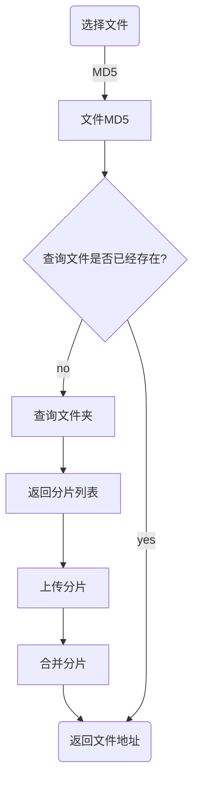

### 大文件分片上传
文件上传失败是老生常谈的问题，常用方案是将一个大文件切片成多个小文件，并行请求接口进行上传，所有请求得到响应后，在服务器端合并所有的分片文件。当分片上传失败，可以在重新上传时进行判断，只上传上次失败的部分，减少用户的等待时间，缓解服务器压力。这就是分片上传文件

<!-- more -->

### 如何实现大文件分片上传
实现大文件分片上传，大致需要安装下面的流程

### 步骤一:MD5加密
MD5 是文件的唯一标识，可以利用文件的 MD5 查询文件的上传状态

### 步骤二:查询文件状态

### 步骤三:文件分片

### 步骤四:分片上传

### 步骤五:合并分片

### 总结