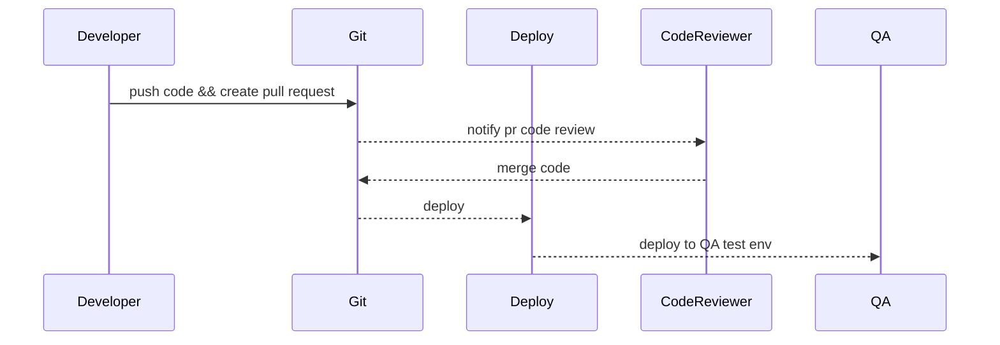
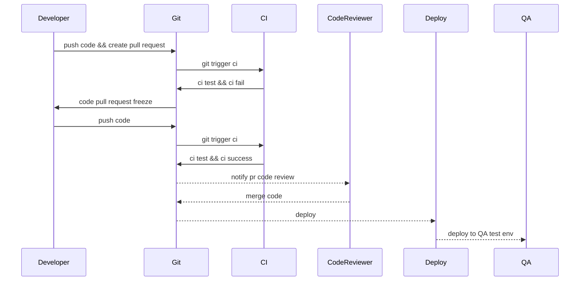

### 再聊CI和CD
之前介绍过CI和CD,但是介绍的比较浅，没有从工程、技术的角度去看，今天我们来详细了解下CI/CD

<!-- more -->

### 什么是CI
首先我们从技术的角度来看，CI(持续集成)是怎么定义的。
持续集成的目的就是尽快的将新功能、改进优化的代码合并到主仓库中来进行测试。如此才能尽快找到合并代码未能预料到的问题并解决。我相信大多数人都同意: 合并不同人的代码的困难度要和整合代码的多少成正比，也就是说，合并代码越慢，造成难度和失败几率越大。
持续集成通常会包括单元测试、回归测试、以及冒烟测试，可以尽快找出回归错误， 因此，就算是只有一个人开发，持续集成仍有其价值。
CI需要的条件:
1. 每个新的功能、改进优化都需要创建自动化的测试用例
2. 需要一台CI服务器来监控代码的提交情况，对每个新的提交进行自动化测试
3. 尽快提交代码。
CI会带来哪些好处:
1. 通过自动化测试可以提早拿到回归测试的结果，避免将一些问题提交到交付生产中
2. 发布编译将会更加容易，因为合并之初已经将所有问题都规避了
3. 减少工作问题切换，研发可以很快获得构建失败的消息，在开始下一个任务之前就可以很快解决。
4. 测试成本大幅降低-你的CI服务器可以在几秒钟之内运行上百条测试。

### CD又怎么理解呢
我们可以理解下CD的第一层意是:持续部署，
持续部署的目的就是让我们的代码，快速的部署到不同的环境，至于有哪些环境，各个公司都有自己的规定，常见的有:
- 测试环境
- stage环境
- pre-prod环境
- 正式环境

再来看看CD的第二层意义: 持续交互,其实从我的角度理解持续交互和持续部署没有特别大的区别。

CD需要的条件:
1. 完善的测试，非常完善的单元测试，比较高的测试覆盖率
2. 自动化的部署，
3. 你的版本和部署频率要保持一致
CD带来的好处
1. 繁琐的部署工作没有了。你的团队不在需要花费几天的时间去准备一个发布
2. 客户每天都可以看到我们的持续改进和提升，而不是每个月或者每季度，或者每年
3. 发布频率更快，因为你不需要停下来等待发布。每一处提交都会自动触发发布流

### 我们为什么需要引入CI/CD

首先来看看之前的流程,可以[参考](https://guides.github.com/introduction/flow/)

这个流程是，在CI之前比较常见的，没有CI的环节。最终都依赖QA的环节，来保证代码的健壮性

我们来看看新的流程

我们加了CI的环节,在合并代码之前每次提交都可以进行测试，越早的检查代码的问题，减少出错的可能性，提高了代码的健壮性

### 都有哪些CI工具

1. jenkins
2. travis / circle ci [参考](https://juejin.im/post/6844903997225058311)
3. gitlab [参考](https://docs.gitlab.com/ee/ci/examples/test-clojure-application.html),[参考](https://juejin.im/post/6844904096760086542)
4. github actions [参考](http://www.ruanyifeng.com/blog/2019/09/getting-started-with-github-actions.html)
